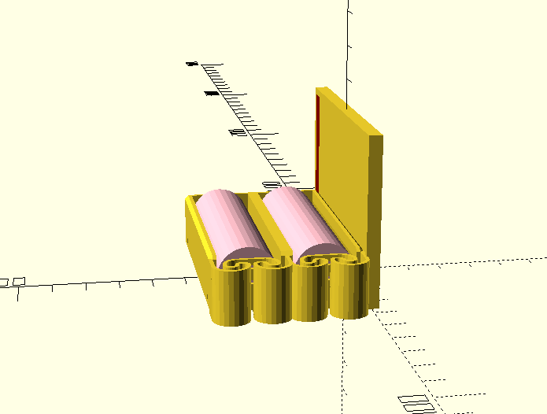

# Подсветка для рамки кадров рентгеноскопии 

## Frame Backlight

Model for 3D-printing of language OpenScad.
Backlight powered from akkum 18650 LiIon.

# Hyperlinks

1. [OpenScad model holder of double akkum 18650](https://www.thingiverse.com/thing:456900) on site thingiverse